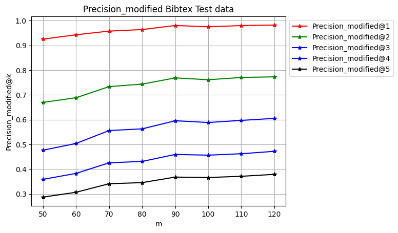
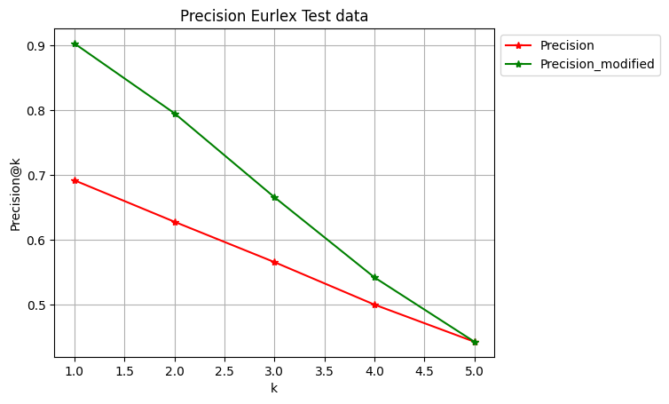
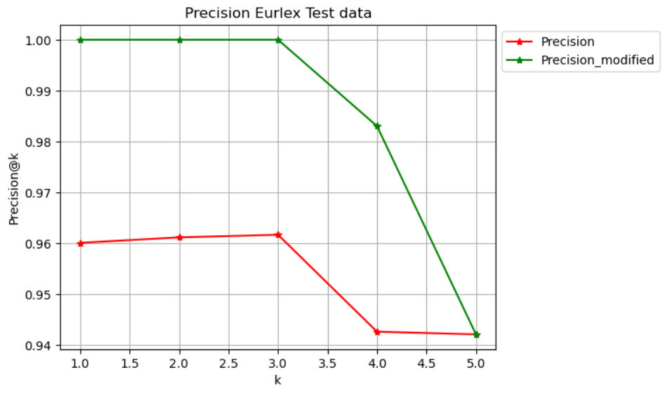

# Multilabel Classification via Hierarchical Partitioning and Data-Dependent Grouping

This repository contains an implementation of the paper [**Multilabel Classification by Hierarchical Partitioning and Data-dependent Grouping**](https://arxiv.org/abs/2006.14084) by Ubaru et al., 2020. We reproduce and extend their method to tackle large-scale multilabel classification problems using advanced grouping and partitioning strategies, with a focus on efficient training and high prediction accuracy.

## Problem Overview

Multilabel classification involves assigning multiple labels to a single data point. Challenges in large-scale scenarios include:

- **Label Sparsity**: Most instances have only a small subset of active labels.
- **Unknown Label Hierarchy**: Latent structure among labels is not explicitly provided but impacts performance.

This project addresses these issues using:

- **Data-dependent group testing** via NMF
- **Hierarchical label partitioning**
- **Efficient prediction using fast decoding algorithms**

## Methodology

### NMFGT (Nonnegative Matrix Factorization Group Testing)

The NMFGT method leverages label correlations to perform efficient multilabel classification using group testing strategies.

1. **Label Correlation Matrix**  
   Compute the label co-occurrence matrix `Y Yᵀ`, where `Y ∈ {0,1}^{n×d}` is the label matrix.

2. **NMF Decomposition**  
   Apply Nonnegative Matrix Factorization (NMF) to approximate the correlation matrix:  
   `Y Yᵀ ≈ Hᵀ H`, where `H ∈ ℝ^{m×d}` is a low-rank basis matrix with `m ≪ d`.

3. **Group Testing Matrix A**  
   Construct a binary matrix `A ∈ {0,1}^{m×d}` by sampling from `H`, where each row defines a group of correlated labels.

4. **Z Matrix Construction**  
   Project each label vector `y` into a lower-dimensional binary vector `z` using Boolean matrix multiplication:  
   `z = A ∨ y` (element-wise OR between group and labels).

5. **Group Classifiers**  
   Train `m` classifiers (one per group) to predict the entries of `z` from the input features `x`.  
   We use **Logistic Regression** as the base classifier.

6. **Prediction**  
   For a new input `x`, predict `ẑ` using the trained classifiers.  
   Reconstruct label scores using:  
   `ŷ = Aᵀ ẑ`  
   Then, select top-k highest scoring labels as predictions.

---

### He-NMFGT (Hierarchical Extension of NMFGT)

To handle datasets with extremely large label spaces, we extend NMFGT by incorporating a hierarchical label partitioning scheme.

1. **Hierarchical Partitioning**  
   Treat `Y Yᵀ` as an adjacency matrix and recursively partition the label graph using vertex separators into smaller components:  
   `S, C₁, C₂, ..., C_ℓ`  
   Each subproblem consists of labels in `S ∪ Cᵢ`.

2. **Apply NMFGT to Subproblems**  
   On each subproblem (partitioned label set), independently apply the NMFGT framework.

3. **Aggregate Predictions**  
   Combine the predictions from each partition to form the final multilabel prediction for the original label set.

---

### Autoencoder-Based Label Reduction

We propose an enhancement for He-NMFGT by integrating an **autoencoder** to reduce the high-dimensional label space before applying hierarchical partitioning.

#### Motivation

Multilabel datasets often have thousands of labels, most of which are sparse and redundant. Direct modeling becomes computationally expensive and noisy.

#### Encoder Architecture

**Encoder**

- `Linear(input_dim → 4096)`
- `ReLU`
- `Linear(4096 → 2048)`
- `ReLU`
- `Linear(2048 → 1024)`
- `ReLU`

**Decoder**

- `Linear(1024 → 2048)`
- `ReLU`
- `Linear(2048 → 4096)`
- `ReLU`
- `Linear(4096 → input_dim)`
- `Sigmoid`

#### Outcome

- Reduces label matrix dimensionality (e.g., from 5000 to 1024)
- Preserves essential label structure
- Improves NMFGT/He-NMFGT performance
- Enhances runtime efficiency and generalization

---

## Datasets Used

| Dataset | #Labels | Used In |
| ------- | ------- | ------- |
| Bibtex  | 159     | NMFGT   |
| RCV1x   | 2456    | NMFGT   |
| Eurlex  | 4993    | HeNMFGT |
| Wiki10  | 30938   | HeNMFGT |

These datasets are standard benchmarks in multilabel classification and were chosen to evaluate both the base (NMFGT) and hierarchical (HeNMFGT) methods under varying label-space sizes and sparsity levels.

---

## Evaluation Metrics

We use the following metrics to assess model performance:

- **Precision@k**  
  Measures the fraction of true labels among the top-k predicted labels.

- **Modified Precision@k (Π@k)**  
  Designed specifically for binary multilabel outputs. Computes the number of correct predictions among the top 5 scored labels, normalized by k.

- **Hamming Loss**  
  Bitwise error rate between the predicted label vector and the ground truth. Lower is better.

---

## Results Summary

- **NMFGT** outperforms the original implementation by Ubaru et al. on **Bibtex** and **RCV1x** datasets.

- **HeNMFGT** achieves competitive results on large-label datasets like **Eurlex** and **Wiki10**.
- **Autoencoder-enhanced HeNMFGT** dramatically improves performance, especially on the Eurlex dataset—achieving nearly perfect top-k precision.

These results validate the efficacy of both hierarchical decomposition and deep label compression in large-scale multilabel classification.

---
